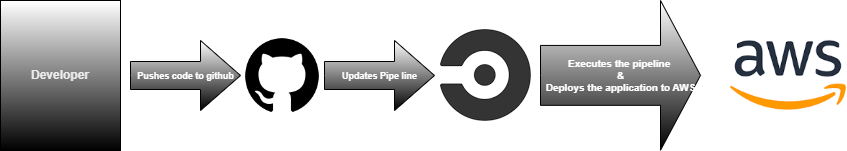

# Pipeline Process

## Build

- Install node
- Setup aws
- Install browser tools and drivers and binary path for browser (chrome in this case) for frontend tests
- Install fronend dependencies
- Install backend/api dependencies
- Lint the fronend
- Run frontend tests
- Build the frontend
- Build the backend
- Deploy the app to aws

## Hold

-Approve the process for deployment

## Deploy

- Setup eb
- Deploy the app to aws
- Any changes that is commited and pushed to the codebase will trigger the pipeline

